# Colorslide tutorial

You've made a simple game in Defold already? Now it's time to add a level selection screen and a basic Graphical User Interface!

Welcome to the Colorslide tutorial. In this guide, you'll add a complete GUI flow to an existing multi-level puzzle game.

This tutorial requires basic familiarity with the Defold Editor ([check out the Editor overview](https://defold.com/manuals/editor/)) and knowledge about [Defold building blocks](https://defold.com/manuals/building-blocks/). If you're new to Defold, check our learning resources on the [Learn website](https://defold.com/learn/), other [tutorials](https://defold.com/tutorials/) and [manuals](https://defold.com/manuals/introduction/).

## What you'll learn

Colorslide is a tile puzzle where you move colored faces until each one reaches a matching tile.

By the end of the tutorial, you will learn how to:

1. Load different levels using collection proxies.
2. Build a level selection GUI with buttons, labels, and input handling.
3. Add an in-level GUI with a back button, level label, and a completion popup.
4. Create a start screen and connect it to the rest of the game flow.

These steps should take about 30 minutes. Most of the gameplay code is already prepared, so you can focus on GUI flow and messaging.

## Try the game

Before beginning the tutorial, [build and run](defold://project.build) the game to try it. You can also select <kbd>Project</kbd> ▸ <kbd>Build</kbd> in the menu or shortcut <kbd>Ctrl</kbd>+<kbd>B</kbd> (<kbd>Cmd</kbd>+<kbd>B</kbd> on Mac).

Tip: When you have this tutorial `README.md` file opened in the Defold Editor, you can use the links in here to perform certain actions, like running the game via the link above, or opening a file.

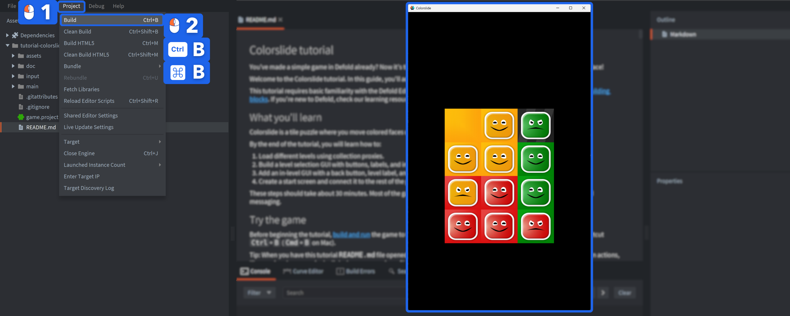

Try clicking one of these colored faces with the left mouse button to move them to the free space. To complete the level, move all the colored faces to the cells wherein their color matches with them.

Right now, after moving all the colored faces to the matching positions, nothing happens. We'll add a message about the complete level later.

For now, we're going to change the level to load as the first step of our changes!

## Changing the level

First, we'll learn the project structure and change the level we are loading.

### Open main collection

Main collection (or "Bootstrap collection") is a collection that is loaded on the start of the game, in our case it's named "main.collection".
Find the file called [`main.collection`](defold://open?path=/main/main.collection) and open it to see how the game is set up.

You can always open any file with the menu item <kbd>File</kbd> ▸ <kbd>Open...</kbd> or shortcut <kbd>Ctrl</kbd>+<kbd>P</kbd> (<kbd>Cmd</kbd>+<kbd>P</kbd> on Mac) and start typing the word "main" to search among all the available assets.

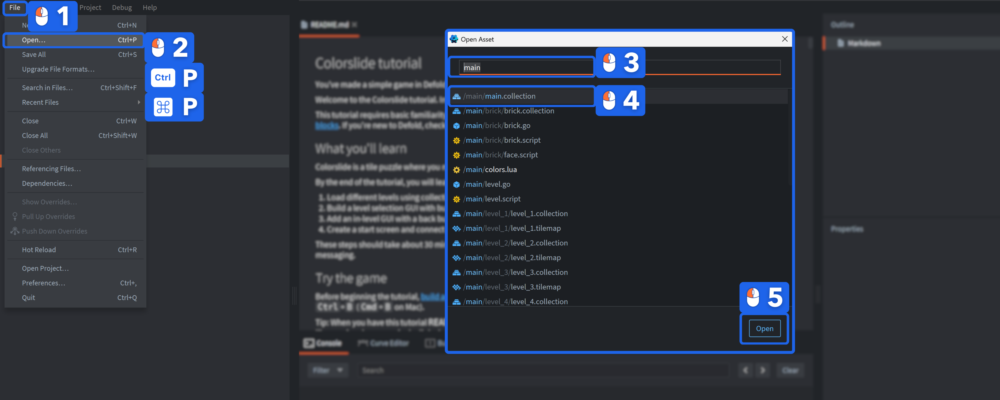

You can also go to the <kbd>Assets</kbd> menu on the left side and find it on your own: Select the folder with the project name `main` (by clicking the ► icon once or double-clicking the name with <kbd>left mouse button</kbd>), and open <kbd>`main.collection`</kbd> (double-click on its name or right click and select <kbd>Open</kbd>).

### Editing side-by-side

It might be convenient for this tutorial to split the Code Editor into two panes, so that you can see `README.md` and the currenly edited file simultaneously.

1. <kbd>Right click</kbd> on the file tab.
2. Select <kbd>Move to Other Tab Pane</kbd>.

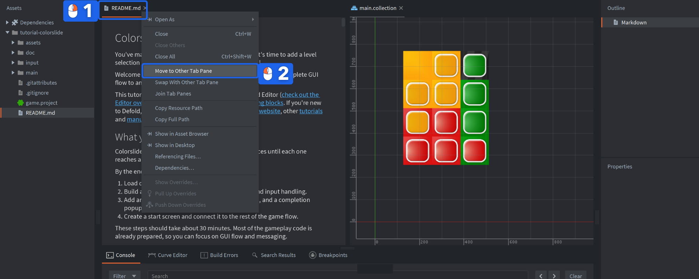

### Investigate the level collection

The <kbd>main.collection</kbd> is a file containing the whole game inside. Check out [the manual page about collections](https://defold.com/manuals/building-blocks/#collections) for the detailed information.

Currently, the level is launched in a subcollection called <kbd>level</kbd> (which is inside the <kbd>main.collection</kbd>) and references the file `/main/level_2/level_2.collection`. If you go to the <kbd>Outline</kbd> pane on the right side and click the arrow `▸` near the <kbd>level</kbd> collection (or double click the collection icon), it'll expand and reveal two game objects:

1. `board`
2. `level`

#### Board game object
    
The `board` game object contains a tilemap component (named here `tiles`), which is a grid of square tiles. Open the [`tilemap`](defold://open?path=/main/level_2/level_2.tilemap) and notice that there are two layers on the tilemap, one is the actual playfield (with the <kbd>board</kbd> layer ID) and one contains the initial setup for the bricks (with <kbd>setup</kbd> layer ID). You can switch their visibility by clicking the eye icon next to them in the Outline.

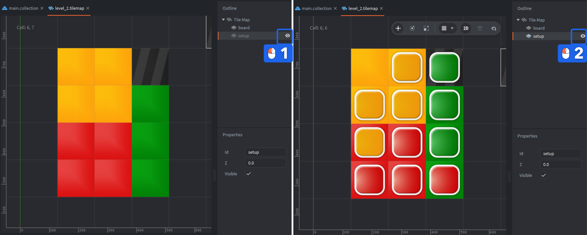

Leave the layers visible at the end.

Check out our manual about [tilemaps](https://defold.com/manuals/tilemap/) for further details.

When the game starts, the code that is already written in this projects looks at the "setup" layer and replaces the brick tiles in-place with separate game objects that can be animated freely. It then clears the layer.

#### Level game object

In Defold game objects can have components. The level game object contains the game logic script component ([`level.script`](defold://open?path=/main/level.script)) and a factory component called `brickfactory` used to spawn bricks on game start. This level game object is stored in a separate file called [`/main/level.go`](defold://open?path=/main/level.go) so game objects of this "blueprint/prototype" file can be instantiated in each separate level collection.

Check out our manual about [factories](https://defold.com/manuals/factory/), if you are interested in more information.

Now try to change the current level to the other one!

### Editing property to change the level

1. Open the [`main.collection`](defold://open?path=/main/main.collection).
2. Make sure you have selected the <kbd>level</kbd> collection. It'll show its properties in the <kbd>`Properties`</kbd> pane on the right side. Properties are a series of editable values about the selected game object. Don't forget to check out [the manual about properties](https://defold.com/manuals/properties/) if you are looking for more information.
3. Find the <kbd>Path</kbd> property and change its value to [`/main/level_3/level_3.collection`](defold://open?path=/main/level_3/level_3.collection). You can manually type it in the text field or locate the file by clicking the <kbd>...</kbd> button to the right of it and in the <kbd>Select Resource</kbd> window, select the file with the same name and click `OK` button (or just double click on it).
4. Save all (Ctrl+S / Cmd+S) by selecting <kbd>File</kbd> ▸ <kbd>Save All</kbd> in the menu or shortcut <kbd>Ctrl</kbd>+<kbd>S</kbd> (<kbd>Cmd</kbd>+<kbd>S</kbd> on Mac)
5. Build and run the game again by selecting <kbd>Project</kbd> ▸ <kbd>Build</kbd> in the menu or shortcut <kbd>Ctrl</kbd>+<kbd>B</kbd> (<kbd>Cmd</kbd>+<kbd>B</kbd> on Mac).

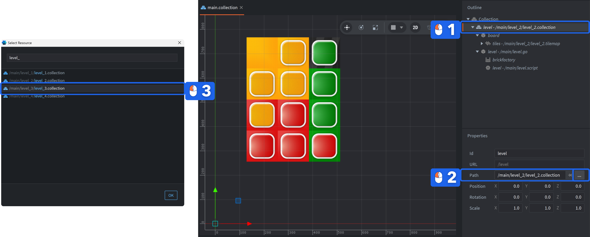

Now you should see a very different look of the level! Try to experiment with the other levels (from 1 to 4).

## Loading the level dynamically

What is needed for this game is a way to make the level loading automatically and depending on player choice. In this case, we're going to use <kbd>collection proxies</kbd>.

<kbd>Collection proxies</kbd> allows you to create a new "world" based on the collection. Any object that is spawned from the collection content will be part of the created world and be automatically destroyed when the collection is unloaded from the proxy.

The new world that is created has an overhead cost attached to it so proxies are not a good fit for spawning large quantities of small collections simultaneously.

You should check out our manual about [collection proxies](https://defold.com/manuals/collection-proxy/) to read more information about them.

### Updating the setup

1. Open the ["main.collection"](defold://open?path=/main/main.collection) file and delete the <kbd>level</kbd> collection reference. You can do that by selecting it with the right mouse button and clicking <kbd>Delete</kbd> or, when it is selected, by pressing <kbd>Delete</kbd> key.

2. Instead of it, add a new game object to the main collection. In the <kbd>Outline</kbd> menu, right click the <kbd>Collection</kbd> and select <kbd>Add Game Object</kbd>. You can also select it once with the left mouse button and press <kbd>A</kbd> key to create the game object.

3. After that, go to the <kbd>Properties</kbd> pane, find the field with <kbd>Id</kbd> name and type in the text field <kbd>loader</kbd>. Make sure you didn't leave a typo - the name must be the same, because we'll reference it in code later on.

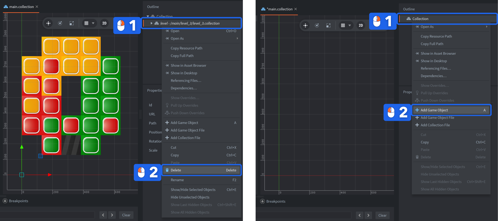

### Adding a Collection Proxy component

1. Now add a <kbd>Collection Proxy</kbd> component to the `loader` game object (right click ▸ <kbd>Add Component</kbd> ▸ <kbd>Collection Proxy</kbd>). Give it a name <kbd>proxy_level_1</kbd> and in the <kbd>Collection</kbd> property, select (or type):
    ```lua
    /main/level_1/level_1.collection
    ```
2. Repeat the step 1 for 4 levels - creating collection proxies for each.

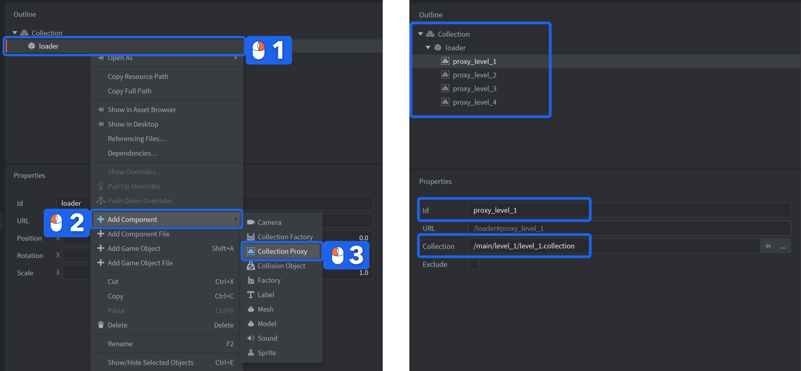

### Creating a script to handle loading

Here we need to add a new script to the project to complete this step. Do the following:

1. From <kbd>Assets</kbd> menu, right click the <kbd>main</kbd> folder and select <kbd>New</kbd> ▸ <kbd>Script</kbd>.
2. Name it <kbd>loader</kbd> and click <kbd>Create Script</kbd> or press <kbd>Enter</kbd>. You can skip extension (`.script`), it will be automatically added by Defold.

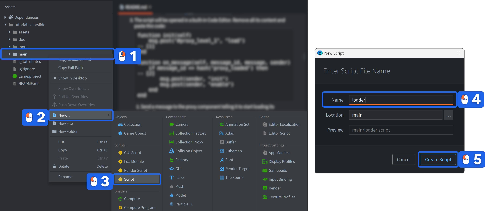

3. The script will be opened in a built-in Code Editor. Remove all its content and paste this code:

   ```lua
   function init(self)
       msg.post("#proxy_level_1", "load")                      -- [1]
   end

   function on_message(self, message_id, message, sender)
       if message_id == hash("proxy_loaded") then              -- [2]
           msg.post(sender, "init")
           msg.post(sender, "enable")
       end
   end
   ```
   1. Send a message to the proxy component telling it to start loading its collection.
   2. When the proxy component is done loading, it sends a `proxy_loaded` message back. You can then send `init` and `enable` messages to the collection to initialize and enable the collection content. We can send these messages back to `sender` which is the proxy component (in this case).

If you need additional information about [how the messaging system works in Defold](https://defold.com/manuals/message-passing/), be sure to check out our manual.

### Attaching the script

1. Save the script. Last step is to attach this script to our loader game object, so get back to the [`main.collection`](defold://open?path=/main/main.collection), right click on the <kbd>loader</kbd> game object, select <kbd>Add Component File</kbd> and select our newly created `loader.script`

2. Add this script to the made collection proxy (right click ▸ <kbd>Add Component File</kbd> and select the `loader.script`).

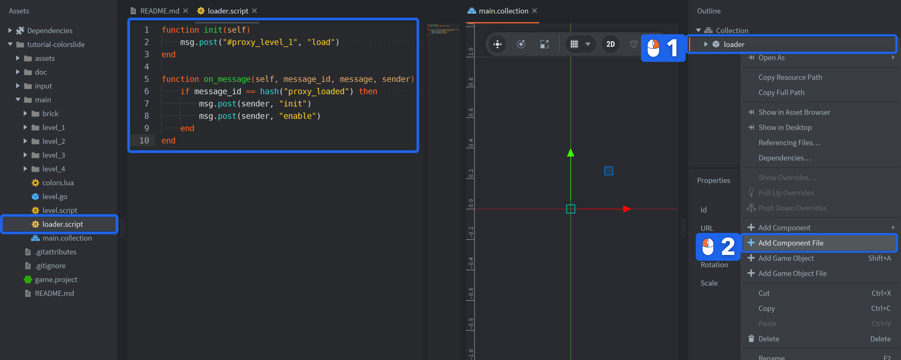


### Reading errors

Now save all (Ctrl+B / Cmd+B) and try to run the game (Ctrl+B / Cmd+B).

Unfortunately there is an instant error. The console says:

```
ERROR:GAMEOBJECT: The collection 'default' could not be created since there is already a socket with the same name.
ERROR:GAMEOBJECT: AcquireResources NewCollection RESULT_OUT_OF_RESOURCES
WARNING:RESOURCE: Unable to create resource: /main/level_1/level_1.collectionc: OUT_OF_RESOURCES
ERROR:GAMESYS: The collection /main/level_1/level_1.collectionc could not be loaded.
```

This error occurs because the proxy tries to create a new world (socket) with the name `default`, but a world with that name already exists - the one created from <kbd>main.collection</kbd> at engine boot. This is a common pitfall, sometimes missed when working with many collections and collection proxies, so it was worth showing it in this tutorial. The socket name is set in the properties of the collection root, so it's very easy to fix.

### Fixing the error

1. Open the [`level_1.collection`](defold://open?path=/main/level_1/level_1.collection). (You can also double click the collection proxy to open it).
2. Click on the root of the collection <kbd>Collection</kbd> in the <kbd>Outline</kbd>.
3. In the <kbd>Properties</kbd> pane. <kbd>Name</kbd> property and set it to `level_1`.
4. Click outside the text field to stop editing it.
5. Repeat the steps 1-4 analogically for the rest: rename the collections: [`level_2.collection`](defold://open?path=/main/level_2/level_2.collection), [`level_3.collection`](defold://open?path=/main/level_3/level_3.collection) and [`level_4.collection`](defold://open?path=/main/level_4/level_4.collection).

TODO: Verify if level_4 can have a name default in the beginning of the tutorial!

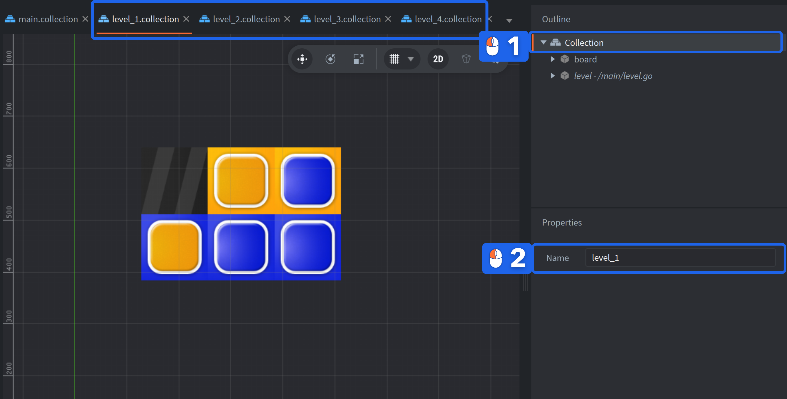

### Problem with inputs

Save all (Ctrl+S / Cmd+S) and try running the game again.

The level now shows up, but if you try to click on the board to move a tile, nothing happens. Why is that?

The problem is that the script that deals with input is now inside the proxied world. The input system works like this:

* It sends input to all game objects in the bootstrap collection that has acquired input focus.
* If one of these objects listening to input contains a proxy, input is directed to any object in the game world behind the proxy that has acquired input focus.

So in order to get input **into** the proxied collection, the game object that contains the proxy component must listen to input.

You should check out our manual about [how input works in Defold](https://defold.com/manuals/input/) to find even more information.

### Fixing the input

1. Open the [`loader.script`](defold://open?path=/main/loader.script) file.
2. Add the following line to the `init` function:

    ```lua
        msg.post(".", "acquire_input_focus")                    -- [1]
    ```
    End result:
    ```lua
    function init(self)
        msg.post("#proxy_level_1", "load")
        msg.post(".", "acquire_input_focus")                    -- [1]
    end
    ```

   1. Since this game object holds the proxy for the collection that needs input, this game object needs to acquire input focus too.

Run the game again. Now everything should work as expected.

### Adding collection proxies for each level

Because the game contains four levels you need to add proxy components for the remaining three levels.

Before, make sure you changed the <kbd>Name</kbd> property of **all** collections to a unique name for each level collection so the socket names don't collide, as described above.

1. In the [`main.collection`](defold://open?path=/main/main.collection) copy the <kbd>`proxy_level_1`</kbd> collection proxy component (right click on it and select <kbd>Copy</kbd> or when it's selected use shortcut <kbd>Ctrl</kbd>+<kbd>C</kbd> or <kbd>Cmd</kbd>+<kbd>C</kbd> on Mac).
2. Then, paste it 3 times, so that we have 4 proxies (right click on `loader` and select <kbd>Paste</kbd> or when it's selected use shortcut <kbd>Ctrl</kbd>+<kbd>V</kbd> or <kbd>Cmd</kbd>+<kbd>V</kbd> on Mac).
2. Change the <kbd>proxy_level_</kbd> to <kbd>proxy_level_4</kbd>, as all other copies increase the last number automatically when pasted, so the rest should be respectively `proxy_level_2` and `proxy_level_3`.
3. For each collection proxy number `X` change the `Collection` property to the coresponding `level_X.collection`, where X is a number (2-4), so that <kbd>proxy_level_2</kbd> has Collection <kbd>level_2</kbd>, and so on.

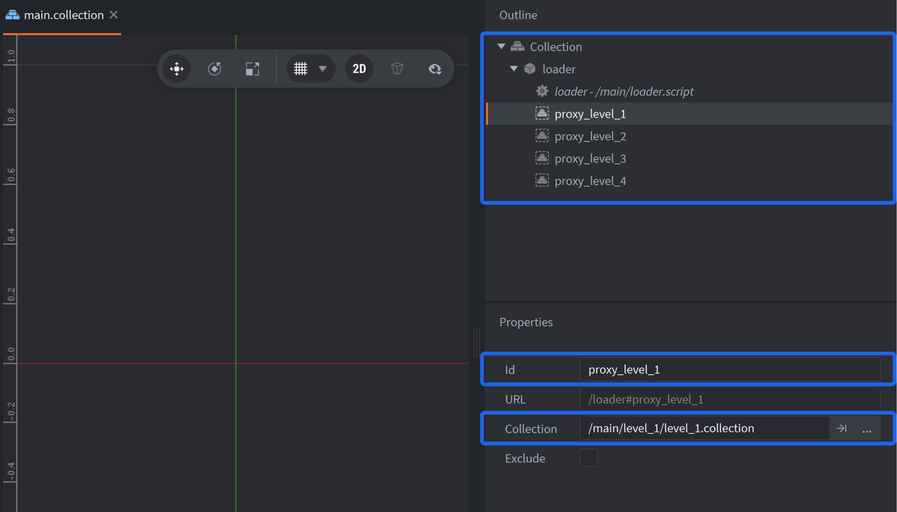

4. Test that each level loads by altering the proxy component you send the "load" message by altering `msg.post("#proxy_level_X", "load")` line where `X` is the number from 1 to 4 in the [`loader.script`](defold://open?path=/main/loader.script). Don't forget to save each time before running the game.

Common pitfall: If you'd forget to create a proxy for some of the levels in the `main.collection`, and when you try to load that level you get an error:

```
ERROR:GAMEOBJECT: Component '/loader#proxy_level_X' could not be found when dispatching message 'load' sent from default:/loader#loader
```

To fix it, you need to simply add collection proxy component for this level in the `main.collection`.

## Adding the level selection menu

Now you have built the setup required to load any level at any moment, so it is time to construct an interface to the level loading.

### Setting up the GUI

First, let's create a new GUI - a Graphical User Interface, which is a component in Defold:

1. In <kbd>Assets</kbd> pane - inside of the <kbd>main</kbd> folder - create a new GUI file (right click on the folder ▸ <kbd>New</kbd> ▸ <kbd>GUI</kbd>) and name it <kbd>level_select</kbd>.

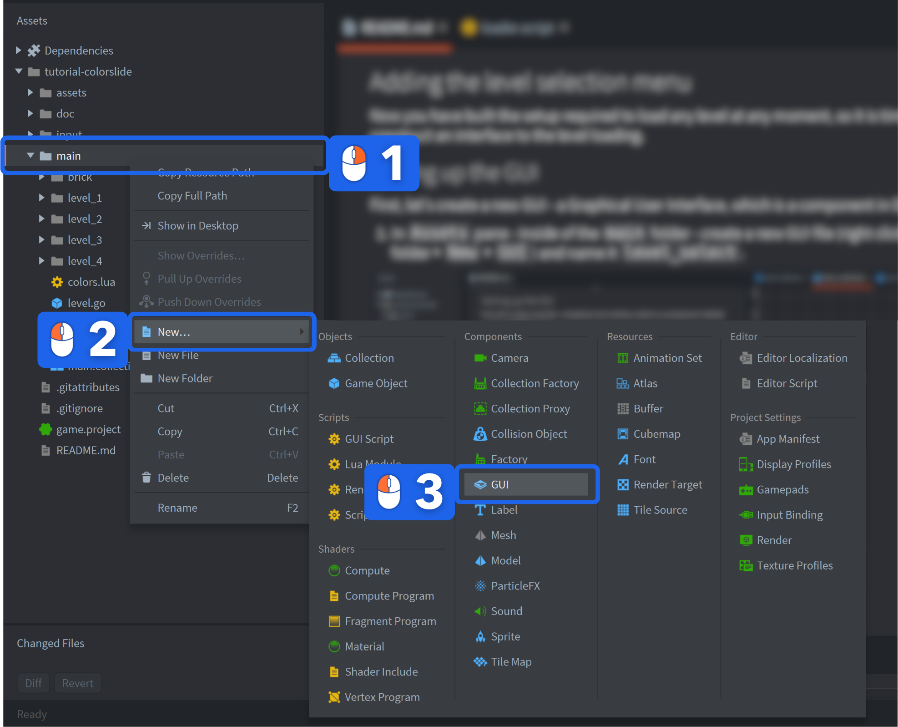

2. It will be opened in the GUI editor, look at the <kbd>Outline</kbd> pane.
3. Add the `bricks` atlas to the <kbd>Textures</kbd> section (right click on <kbd>Textures</kbd> ▸ <kbd>Add</kbd> ▸ <kbd>Textures</kbd> ▸ select `/assets/bricks.atlas`).

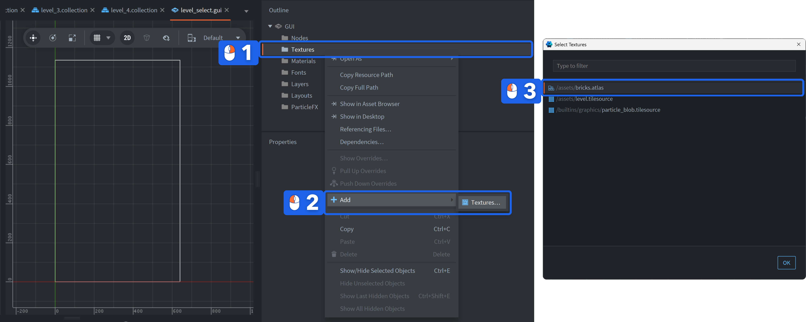

4. Similarly, add the <kbd>headings</kbd> font to the <kbd>Fonts</kbd> section (right click on <kbd>Fonts</kbd> ▸ <kbd>Add</kbd> ▸ <kbd>Fonts</kbd> ▸ select `/assets/headings.font`).

If you are interested in more detailed information about [atlases](https://defold.com/manuals/atlas/) and [fonts](https://defold.com/manuals/font/) in Defold, check out the manuals.

Now we can start creating buttons for our level selection screen!

### Creating the buttons

Construct an interface with 4 buttons, one for each level. Notice that you can copy and paste the created button so you don't have to do each step once again. If you do this, make sure you have correct names in the parent and its children nodes.

While being in the created GUI file, do the following steps:

1. Create `Box` node (right click on <kbd>Nodes</kbd> ▸ <kbd>Add</kbd> ▸ <kbd>Box</kbd>)

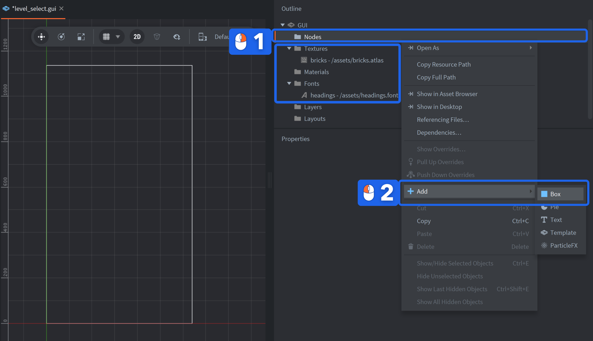

2. Go to <kbd>Properties</kbd> menu.
3. Set <kbd>Id</kbd> property of the created box nodes to `button_level_1`.
4. Copy and paste this box node in the <kbd>Outline</kbd> 3 more times (so that we have 4 buttons).
5. You can change the order of the selected node in the Outline by clicking arrows up and down while holding the <kbd>Alt</kbd> (<kbd>Option</kbd> on Mac).
5. Change the name of the <kbd>button_level_</kbd> to <kbd>button_level_4</kbd>.
6. For each button now set <kbd>Position</kbd> property to one of the following depending on the level number:
   1. (X: <kbd>212</kbd>, Y: <kbd>700</kbd>, Z: <kbd>0</kbd>).
   2. (X: <kbd>428</kbd>, Y: <kbd>700</kbd>, Z: <kbd>0</kbd>).
   3. (X: <kbd>212</kbd>, Y: <kbd>500</kbd>, Z: <kbd>0</kbd>).
   4. (X: <kbd>428</kbd>, Y: <kbd>500</kbd>, Z: <kbd>0</kbd>).
5. For convenience, while holding <kbd>Shift</kbd> select all the nodes in the Outline (click first and last), or for each of the nodes sepearately, and set <kbd>Size Mode</kbd> property to <kbd>Manual</kbd>. This will make editing <kbd>Size</kbd> property available.
6. Set <kbd>Size</kbd> property to: (X: <kbd>150</kbd>, Y: <kbd>100</kbd>, Z: <kbd>0</kbd>).
7. Set <kbd>Alpha</kbd> property to <kbd>0</kbd> (you can type manually or drag the slider to the left).

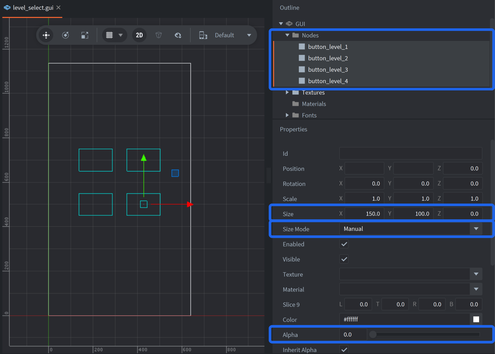

Check out our manual about [GUI scenes](https://defold.com/manuals/gui/) if you need some more information about how to use it.

If you'd change the size of your graphics make sure that each root node is big enough to cover the whole button graphics because the root node will be used to test input against. It is a common technique to make input area a bit bigger than the visuals of the button itself, as it is helpful especially for touch input devices.

This is the configuration of the root node. Now you need to setup the sprite and the text and these will be the children (nested) nodes.

#### Button visuals

For each of the created buttons do the following steps (or do it once for the first button and the copy/paste for the rest, but then don't forget to change the `Ids`):

1. Add a child `Box` node (right click on the root `button_level_X` node (where `X` is the number from 1 to 4) and select <kbd>Add</kbd> ▸ <kbd>Box</kbd>).
2. Go to <kbd>Properties</kbd> menu.
3. Set <kbd>Id</kbd> property to `button_level_X_bg` (where `X` is the number from 1 to 4). You can also click <kbd>F2</kbd> in the Outline to start editing the name in place.
4. Set <kbd>Size Mode</kbd> property to <kbd>Manual</kbd>. This will make editing <kbd>Size</kbd> and <kbd>Slice-9</kbd> properties available.
5. Set <kbd>Size</kbd> property to: (X: <kbd>150</kbd>, Y: <kbd>100</kbd>, Z: <kbd>0</kbd>).
6. Set <kbd>Texture</kbd> property to `bricks/button`.
7. Set <kbd>Slice-9</kbd> property to: (L: <kbd>40</kbd>, T: <kbd>40</kbd>, R: <kbd>40</kbd>, B: <kbd>40</kbd>). This is important to type because it will cause adjusting the sprite's edges so it won't be stretched.
8. Uncheck <kbd>Inherit Alpha</kbd> property so it renders even if its parent is transparent.

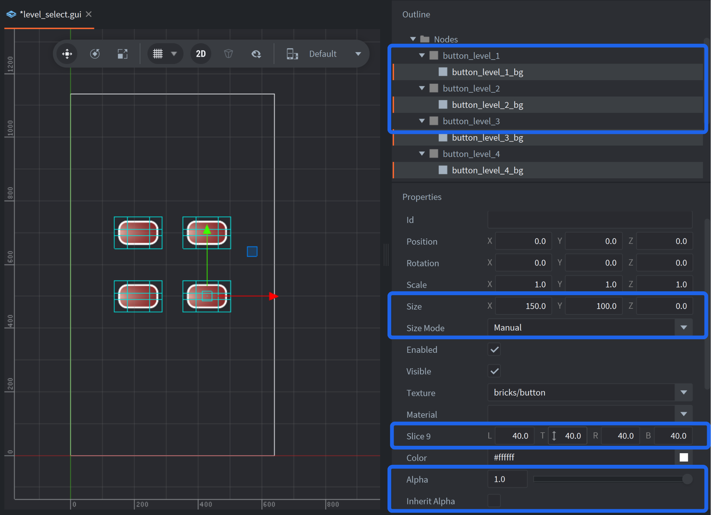

If you need more detailed information about [how the slice-9 sprites](https://defold.com/examples/gui/slice9/) work in Defold, check out the manual page.

We have done the first of two children nodes. Now we have the last element to create!

#### Button texts

For each of the created now buttons do the following steps (or do it once for the first button and the copy/paste for the rest, but then don't forget to change the `Ids`):

1. Add a child `Text` node (right click on the root `button_level_X_bg` node (where `X` is the number from 1 to 4) and select <kbd>Add</kbd> ▸ <kbd>Text</kbd>).
2. Go to <kbd>Properties</kbd> menu.
3. Set <kbd>Id</kbd> property to `button_level_X_text` (where `X` is the number from 1 to 4). You can also click <kbd>F2</kbd> in the Outline to start editing the name in place.
4. Set <kbd>Size</kbd> property to: (X: <kbd>150</kbd>, Y: <kbd>100</kbd>, Z: <kbd>0</kbd>).
5. Set <kbd>Text</kbd> property to `X` (where `X` is the number from 1 to 4).
6. Set <kbd>Font</kbd> property to `headings`.

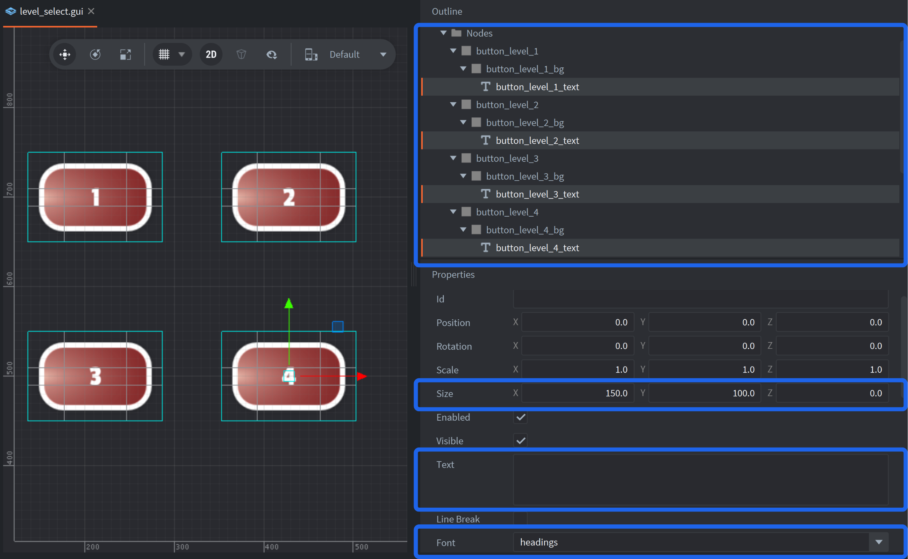

We have prepared everything we need to display the buttons!

The header text is the last thing we need to complete creating the GUI!

### Creating the header

1. Create `Text` node but this time outside of any root nodes for the buttons (right click on <kbd>Nodes</kbd> ▸ <kbd>Add</kbd> ▸ <kbd>Text</kbd>).
2. Go to <kbd>Properties</kbd> menu.
3. Set <kbd>Id</kbd> property to `select_level_header`.
4. Set <kbd>Position</kbd> property to: (X: <kbd>320</kbd>, Y: <kbd>900</kbd>, Z: <kbd>0</kbd>).
5. Set <kbd>Size</kbd> property to: (X: <kbd>320</kbd>, Y: <kbd>64</kbd>, Z: <kbd>0</kbd>).
6. Set <kbd>Text</kbd> property to `SELECT LEVEL`.
7. Set <kbd>Font</kbd> property to `headings`.

That's it! You should have everything setup as on this image:

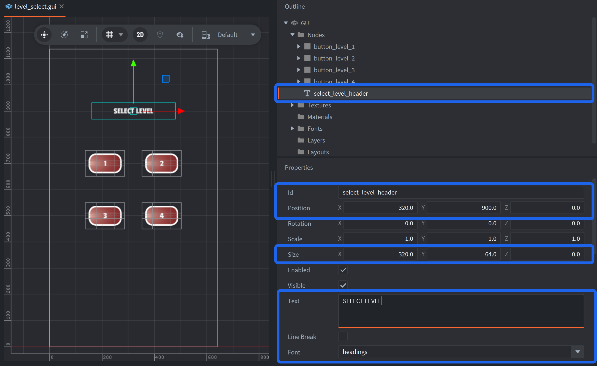

Now we're going to add extra code to make it work!

### Adding the code

For programming GUI, we use a special kind of script in Defold: <kbd>GUI Script</kbd>. You can check out the manual we have about the [GUI scripts](https://defold.com/manuals/gui-script/).

Here's what you need to do:

1. In <kbd>Assets</kbd> pane, right click the <kbd>main</kbd> folder and select <kbd>New</kbd> ▸ <kbd>GUI Script</kbd>.
2. Name it <kbd>level_select</kbd> and click <kbd>Create GUI Script</kbd> or press <kbd>Enter</kbd>. You can skip the extension (`.gui_script`), it will be automatically added by Defold.
3. The GUI script will be opened in the code editor, remove all its content and paste this code:

   ```lua
   function init(self)
       msg.post(".", "acquire_input_focus")
       msg.post("#", "show_level_select")                                  -- [1]

       self.active = false
   end

   function on_message(self, message_id, message, sender)
       if message_id == hash("show_level_select") then                     -- [2]
           msg.post("#", "enable")

           self.active = true
       elseif message_id == hash("hide_level_select") then                 -- [3]
           msg.post("#", "disable")

           self.active = false
       end
   end

   function on_input(self, action_id, action)
       if action_id == hash("touch") and action.pressed and self.active then
           for n = 1, 4 do                                                 -- [4]
               local node = gui.get_node("button_level_" .. n)

               if gui.pick_node(node, action.x, action.y) then             -- [5]
                   msg.post("/loader#loader", "load_level", { level = n }) -- [6]
                   msg.post("#", "hide_level_select")                      -- [7]
               end
           end
       end
   end
   ```
   1. Set up the GUI.
   2. Showing and hiding the GUI is triggered via messaging so it can be done from other scripts.
   3. React to the pressing of touch input (as already set up in the [input bindings](defold://open?path=/input/game.input_binding)).
   4. The button nodes are named `button_level_1` to `button_level_4` so they can be looped over.
   5. Check if the touch action happens within the boundaries of node `level_n`. This means that the click happened on the button.
   6. Send a message to the loader script to load level `n`. Notice that a `load` message is not sent directly to the proxy from here since this script does not deal with the rest of the proxy loading logic, as a reaction to `proxy_loaded`.
   7. Hide this GUI.

Now we need to attach the GUI script to the GUI:

1. Go to the created GUI and select its root "GUI" to display its properties.
2. In the <kbd>Properties</kbd> pane find the <kbd>Script</kbd> property and set it to <kbd>`main/level_select.gui_script`</kbd>.

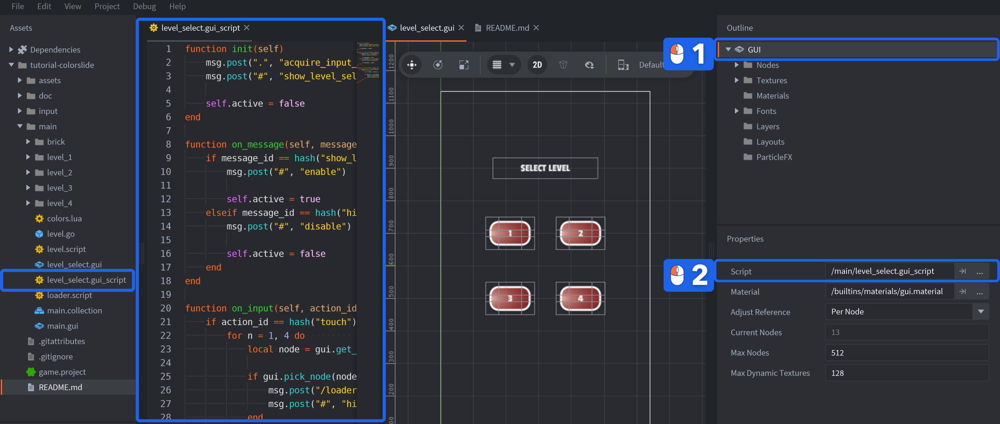

To finish off this step, the loader script needs a bit of new code to react to the `load_level` message, and the proxy loading on init should be removed.

### Updating the loader

1. Open [`loader.script`](defold://open?path=/main/loader.script) and change `init` and `on_message` functions as follows:

    ```lua
    function init(self)
        -- Remove this line:
        -- msg.post("#proxy_level_1", "load")  -- [1]
        msg.post(".", "acquire_input_focus")
    end

    function on_message(self, message_id, message, sender)
        -- Add this "load_level" message handling branch:
        if message_id == hash("load_level") then
            local proxy = "#proxy_level_" .. message.level  -- [2]

            msg.post(proxy, "load")
        --
        elseif message_id == hash("proxy_loaded") then
            msg.post(sender, "init")
            msg.post(sender, "enable")
        end
    end
    ```
    1. First, remove the line where we requested to load a hardcoded level_1.
    2. Then, handle the "load_level" message" - construct which proxy to load based on message data.

That's not the end. We need to add our level select to the game! 

### Add level select screen to the game

Do the following steps:

1. Go to ["main.collection"](defold://open?path=/main/main.collection).
2. Add a new game object to it and name it <kbd>guis</kbd>.
3. Right click on this game object, click <kbd>Add Component File</kbd>, and select `main/level_select.gui`).

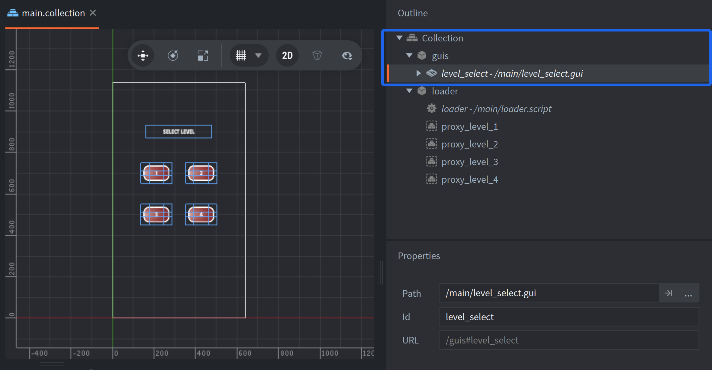

Save all, run the game and test the level selector screen. You should be able to click any of the level buttons and the corresponding level will load and be playable. Great!

## Adding the GUI to the level

You can now start and play a level, but there is no way to go back.

The next step is to add an in game GUI that allows you to navigate back to the level selection screen. It should also congratulate the player when the level is completed and allow moving directly to the next level.

### Creating the in-game GUI

The first step is to create another GUI for the level. You should be already familiar with the process - to simplify now, we will reuse our previously created GUI, so duplicate it and name "level" - follow these steps:

1. Go to <kbd>Assets</kbd> menu.
2. Locate the <kbd>`level_select.gui`</kbd> file inside of `main` folder, copy it (right click on it ▸ <kbd>Copy</kbd> or shortcut <kbd>Ctrl</kbd> + <kbd>C</kbd> / <kbd>Cmd</kbd> + <kbd>C</kbd> on Mac) and paste it inside `main` (right click on the main folder ▸ <kbd>Paste</kbd> or shortcut <kbd>Ctrl</kbd> + <kbd>V</kbd> / <kbd>Cmd</kbd> + <kbd>V</kbd> on Mac).
3. Rename the duplicated GUI to <kbd>`level.gui`</kbd>.
4. Open it and go to <kbd>Outline</kbd> pane.

### Adjusting the in-game GUI

We only need one button - to get back to the `level_select` GUI. So remove the remaining 3 of them and leave only one:

1. In the <kbd>Outline</kbd>, while holding <kbd>Shift</kbd>, select buttons from 2-4 and click <kbd>Delete</kbd> key.
2. Rename the `button_level_1` to <kbd>`button_back`</kbd> (right click on it ▸ <kbd>Rename</kbd> or shortcut <kbd>F2</kbd> or rename in the <kbd>Properties</kbd> pane).
3. Change the "Position" property of this node `button_back` to (X: <kbd>125</kbd>, Y: <kbd>1086</kbd>, Z: <kbd>0</kbd>).
4. Select and rename the child box node `button_level_1_bg` to <kbd>`button_back_bg`</kbd>.
5. Select and rename the child text node `button_level_1_text` to <kbd>`button_back_text`</kbd>.
6. Change the "Text" property of the `button_back_text` text node to <kbd>`Back`</kbd>.

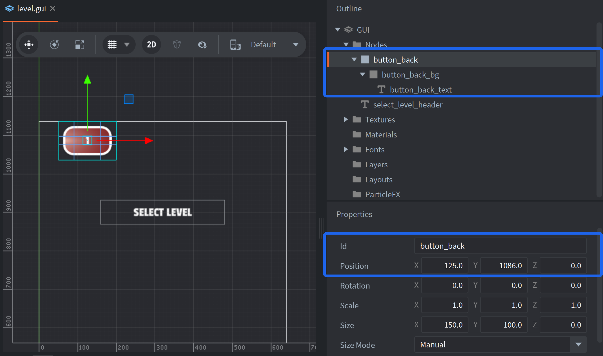

### Adding a level number information

Now, we'll reuse the "SELECT LEVEL" text node:

1. Rename the `select_level_header` text node to <kbd>`level_number`</kbd>.
2. Change the "Position" property to: (X: <kbd>500</kbd>, Y: <kbd>1085</kbd>, Z: <kbd>0</kbd>).
3. Change the "Size" property to: (X: <kbd>180</kbd>, Y: <kbd>64</kbd>, Z: <kbd>0</kbd>).
4. Change the "Text" property of this node to <kbd>`LEVEL 1`</kbd>.

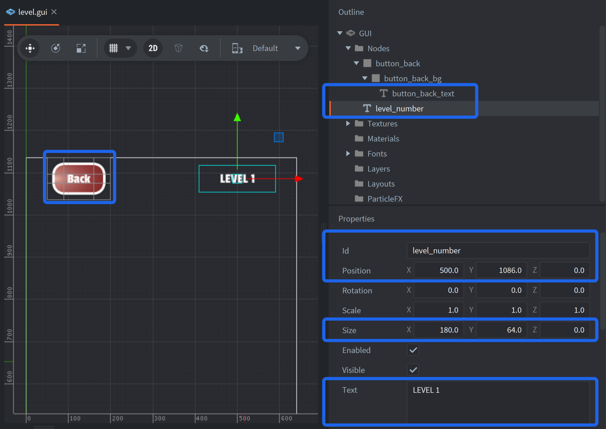

Now we need to add a message for level complete with a "well done" message and a button to advance to the next level.

### Adding the complete level GUI

While being in the created root node, do the following:

1. Create `Box` node (right click on the root node "Nodes", and click <kbd>Add</kbd> ▸ <kbd>Box</kbd>).
2. Go to <kbd>Properties</kbd> menu.
3. Set <kbd>Id</kbd> property to `well_done_message`.
4. Set <kbd>Position</kbd> property to: (X: <kbd>990</kbd>, Y: <kbd>568</kbd>, Z: <kbd>0</kbd>). You might wonder, why we put it outside the white rectangle showing our game resolution, but we do it on purpose here - we need to place it outside of the view so it can slide into view when the level is completed.
5. Set <kbd>Size</kbd> property to: (X: <kbd>650</kbd>, Y: <kbd>350</kbd>, Z: <kbd>0</kbd>).
6. Set <kbd>Color</kbd> property to `#cccccc` (you can type it manually or select the color picker to the right and click on the cell in the second row and fourth column).

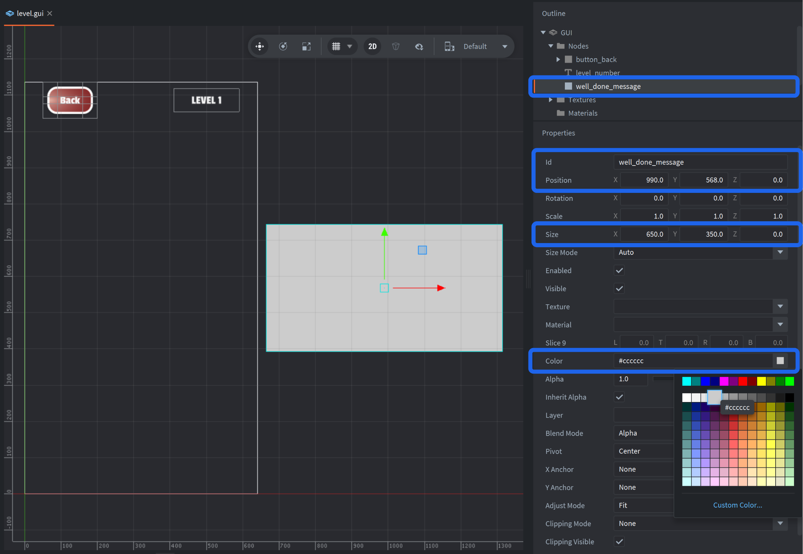

We have a background. Now the rest of the elements!

### Adding the complete level message

To create a text as a child of our `well_done_message` node, follow these steps:

1. Create `Text` node (right click on the `well_done_message` node ▸ <kbd>Add</kbd> ▸ <kbd>Text</kbd>).
2. Go to <kbd>Properties</kbd> menu.
3. Set <kbd>Id</kbd> property to `well_done_message_text`.
4. Set <kbd>Position</kbd> property to: (X: <kbd>0</kbd>, Y: <kbd>70</kbd>, Z: <kbd>0</kbd>).
6. Set <kbd>Text</kbd> property to `Well done!`.
7. Set <kbd>Font</kbd> property to `headings`.
8. Set <kbd>Color</kbd> property to `#000000` (you can type it manually or select the color picker to the right and click on the cell in the second row and the last column to the right).

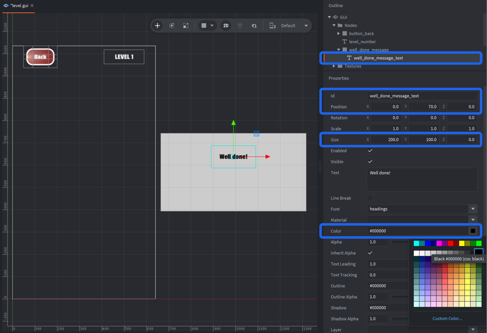

The last thing to do is the button to proceed to the next level.

### Adding a next level button

We will again reuse the existing button, that we created:

1. Copy the `button_back` node. It will be copied with all its children.
2. Paste it inside the `well_done_message` box node.
3. Rename the <kbd>Id</kbd> property of the `button_back1` to <kbd>`button_next`</kbd>.
4. Change the <kbd>Position</kbd> property of the <kbd>`button_next`</kbd> to (X: <kbd>0</kbd>, Y: <kbd>-70</kbd>, Z: <kbd>0</kbd>).
5. Rename the <kbd>Id</kbd> property of the child `button_back_bg1` to <kbd>`button_next_bg`</kbd>.
6. Change the <kbd>Texture</kbd> property of the <kbd>`button_next_bg`</kbd> to <kbd>`bricks/green`</kbd> to make the button green.
7. Rename the <kbd>Id</kbd> property of the child `button_back_text1` to <kbd>`button_next_text`</kbd>.
5. Change the <kbd>Text</kbd> property of the <kbd>`button_next_text`</kbd> text node to <kbd>`Next`</kbd>.

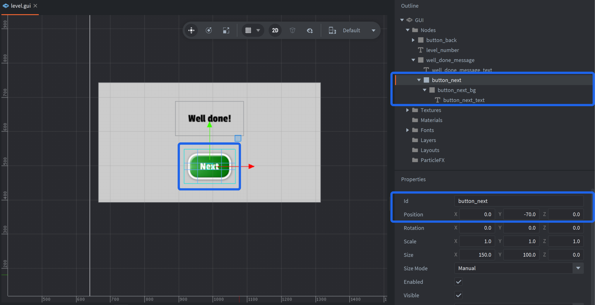

Usually, GUI might have a lot of elements that could be reused, like the buttons we are copying. In Defold, you can maintain such similar elements in the GUI using the [templates](https://defold.com/manuals/gui-template/). We are not using them in this tutorial, but we recommend to check out the manual later on.

The GUI is complete. Now we need to put additional code to make it work!

### Adding the code for the message

1. From <kbd>Assets</kbd> menu, right click the <kbd>main</kbd> folder and select <kbd>New</kbd> ▸ <kbd>GUI Script</kbd>.
2. Name it <kbd>`level`</kbd> and click <kbd>Create GUI Script</kbd> or press <kbd>Enter</kbd>.
3. File [`level.gui_script`](defold://open?path=/main/level.gui_script) will be created and opened in the Code Editor.
4. Remove all its content and paste this code:
   ```lua
   function on_message(self, message_id, message, sender)
       if message_id == hash("level_completed") then                       -- [1]
           local well_done_message = gui.get_node("well_done_message")

           gui.animate(well_done_message, "position.x", 320, gui.EASING_OUTSINE, 1, 1.5)
       end
   end

   function on_input(self, action_id, action)                              -- [2]
       if action_id == hash("touch") and action.pressed then
           local button_back = gui.get_node("button_back")

           if gui.pick_node(button_back, action.x, action.y) then
               msg.post("default:/guis#level_select", "show_level_select") -- [3]
               msg.post("default:/loader#loader", "unload_level")
           end
   
           local button_next = gui.get_node("button_next")

           if gui.pick_node(button_next, action.x, action.y) then
               msg.post("default:/loader#loader", "next_level")            -- [4]
           end
       end
   end
   ```
   1. If message `level_complete` is received, slide the `well_done_message` panel with the `button_next` button into view.
   2. This GUI will be put on the `level` game object which already acquires input focus (through `level.script`) so this script should not do that.
   3. If the player presses `back`, tell the level selector to show itself and the loader to unload the level. Note that the socket name of the bootstrap collection is used in the address.
   4. If the player presses `button_next`, tell the loader to load the next level.

Now we need to attach the GUI Script to the GUI:

1. Go to the created [`level.gui`](defold://open?path=/main/level.gui) and select "GUI" to display its properties.
2. In the <kbd>Properties</kbd> pane change the <kbd>Script</kbd> property to `main/level.gui_script`.

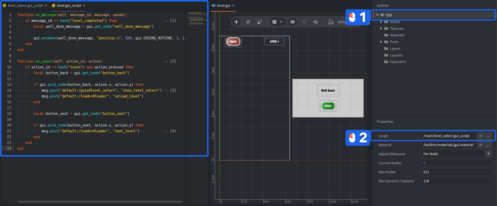

If you need more information about [how addressing works in Defold](https://defold.com/manuals/addressing/), be sure to check out the manual.

### Modifying the loader script to handle level number

We also need to make additional changes to the already existing game objects. Do these steps:

1. Open the [`loader.script`](defold://open?path=/main/loader.script) file.
2. Change its content to the following:
    ```lua
    function init(self)
	    msg.post(".", "acquire_input_focus")

	    -- Add this line:
	    self.current_level = 0	-- [1]
    end

    function on_message(self, message_id, message, sender)
        if message_id == hash("load_level") then
            -- Add this line:
            self.current_level = message.level	-- [2]

            local proxy = "#proxy_level_" .. message.level
            msg.post(proxy, "load")

        -- Add these lines:
        elseif message_id == hash("next_level") then                        -- [3]
            msg.post("#", "unload_level")
            msg.post("#", "load_level", { level = self.current_level + 1 })
        elseif message_id == hash("unload_level") then                      -- [4]
            local proxy = "#proxy_level_" .. self.current_level

            msg.post(proxy, "disable")
            msg.post(proxy, "final")
            msg.post(proxy, "unload")
        --
        
        elseif message_id == hash("proxy_loaded") then
            msg.post(sender, "init")
            msg.post(sender, "enable")
        end
    end
    ```
    1. Keep track of the currently loaded level so it can be unloaded and it is possible to advance to the next one.
    2. Update the current level whenever we load a new level.
    3. Load next level. Note that there is no check if there actually exists a next level.
    4. Unload the currently loaded level.

### Modifying the level script to handle level number

1. Open the [`level.script`](defold://open?path=/main/level.script) file.
2. Add a message to the level GUI when the game is finished:
    Put this line:
    ```lua
    msg.post("#gui", "level_completed") -- [1]
    ```
    there at the end of the `on_input` function inside the last if condition `all_correct(self.bricks)` (below line 117):
    ```lua
                    -- check if the board is solved
                    if all_correct(self.bricks) then

                        -- Add this line:
                        msg.post("#gui", "level_completed") -- [1]

                        self.completed = true
                    end
    ```
    1. Tell the GUI to show the level completed panel.

### Modifying the level game object to handle level number

1. Open the [`level.go`](defold://open?path=/main/level.go) file.
2. Right click on this game object and <kbd>Add Component File</kbd> ▸ <kbd>`level.gui`</kbd>.
3. Set its <kbd>Id</kbd> property to `gui`.

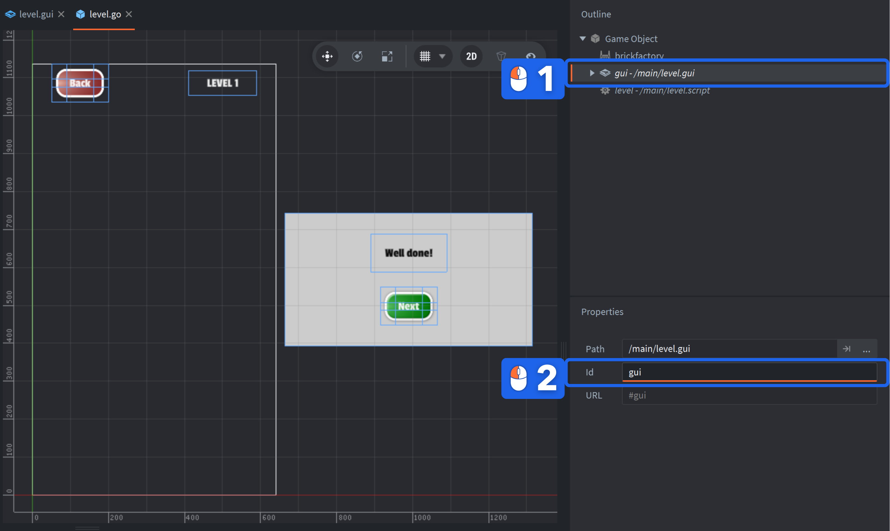

Run the game. You should be able to select a game, go back to the level selection screen (with the <kbd>Back</kbd> button) and also start the next level when one is finished.

The final piece of the puzzle is the start screen!

## Adding the start screen

We will once again duplicate the GUI, this time, copy and paste the [`level.gui`](defold://open?path=/main/level.gui).

1. In the "Assets" pane in the "main" folder, copy and paste the `level.gui`.
2. Rename it to <kbd>`start.gui`</kbd>.
3. Open it and delete the "Back" button (`button_back` gui node) and the "Level number" (`level_number` text node).
4. Change the parent `well_done_message` gui node:
    - Rename the `well_done_message` to <kbd>`welcome`</kbd>.
    - Change the <kbd>Position</kbd> property of the `welcome` to (X: <kbd>320</kbd>, Y: <kbd>568.0</kbd>, Z: <kbd>0</kbd>).
    - Change the <kbd>Size</kbd> property of the `welcome` to (X: <kbd>650</kbd>, Y: <kbd>1150.0</kbd>, Z: <kbd>0</kbd>).

    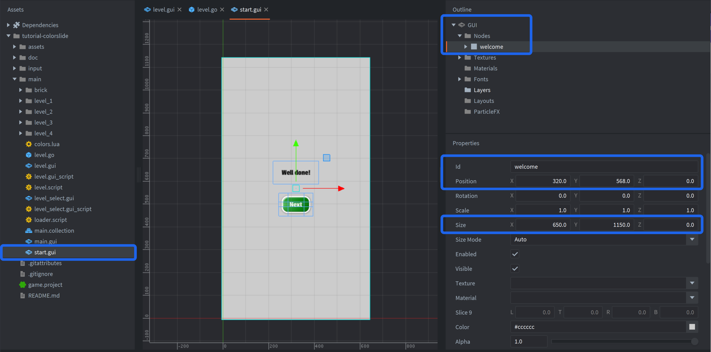

4. Delete the child node `well_done_message_text`.
5. Change the button `button_next` node:
    - Rename the `button_next` to <kbd>`button_start`</kbd>.
    - Rename the `button_next_bg` to <kbd>`button_start_bg`</kbd>.
    - Rename the `button_next_text` to <kbd>`button_start_text`</kbd>.
    - Change the <kbd>Text</kbd> property of the `button_start_text` to <kbd>`Start`</kbd>.

    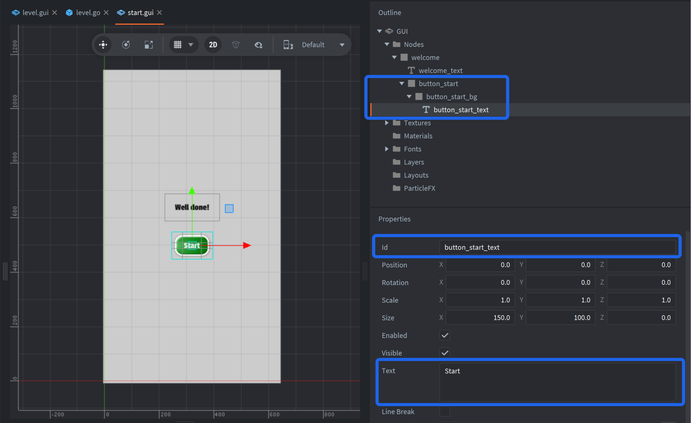

5. Add a logo:
    - Add a new `Box` node (right click on the <kbd>`welcome`</kbd> node and select <kbd>Add</kbd> ▸ <kbd>Box</kbd>)
    - Name it  <kbd>`logo`</kbd>.
    - Move it a bit up, so change its <kbd>Position</kbd> property of the `logo` to (X: <kbd>0.0</kbd>, Y: <kbd>200.0</kbd>, Z: <kbd>0.0</kbd>).
    - Change the <kbd>Scale</kbd> property of the `logo` to (X: <kbd>0.5</kbd>, Y: <kbd>0.5</kbd>, Z: <kbd>1.0</kbd>).
    - Change the <kbd>Texture</kbd> property of the `logo` to <kbd>`bricks/logo`</kbd>.

    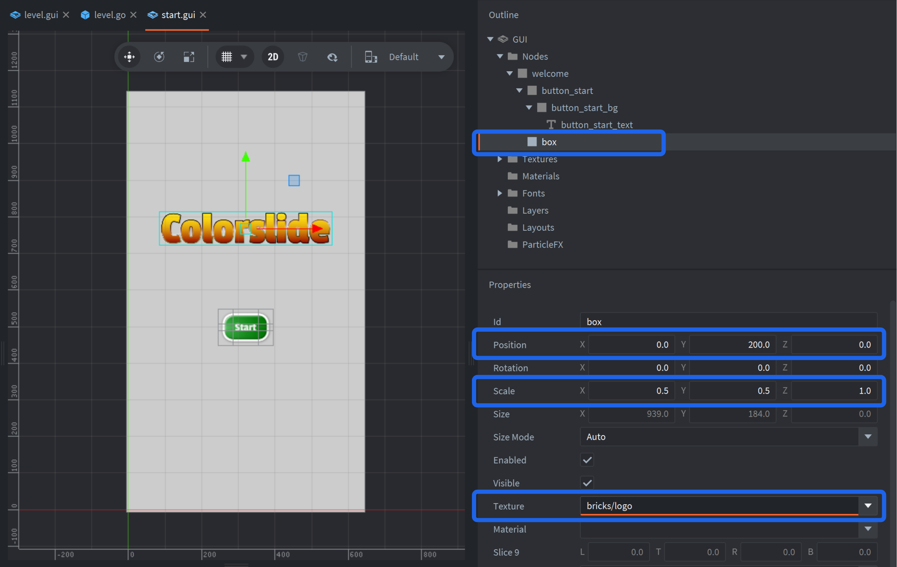

This is the end of creating the start GUI!

Now we need to add some code to make it work!

### Adding the code

1. In the <kbd>Assets</kbd> pane, right click the `main` folder and select <kbd>New</kbd> ▸ <kbd>GUI Script</kbd>.
2. Name it  <kbd>`start`</kbd> and click <kbd>Create GUI Script</kbd> or press <kbd>Enter</kbd>.
3. Open this [`start.gui_script`](defold://open?path=/main/start.gui_script) file, clear it and paste inside the following content:
    ```lua
    function init(self)
        msg.post("#", "show_start")                                         -- [1]

        self.active = false
    end

    function on_message(self, message_id, message, sender)
        if message_id == hash("show_start") then                            -- [2]
            msg.post("#", "enable")

            self.active = true
        elseif message_id == hash("hide_start") then
            msg.post("#", "disable")

            self.active = false
        end
    end

    function on_input(self, action_id, action)
        if action_id == hash("touch") and action.pressed and self.active then
            local start_button = gui.get_node("button_start")

            if gui.pick_node(start_button, action.x, action.y) then          -- [3]
                msg.post("#", "hide_start")
                msg.post("#level_select", "show_level_select")
            end
        end
    end
    ```
    1. Start by showing this screen.
    2. Messages to show and hide this screen.
    3. If the player presses the `start` button, hide this screen and tell the level selection GUI to show itself.

4. Go to the created [`start.gui`](defold://open?path=/main/start.gui) and select "GUI" to display its properties.
5. In the <kbd>Properties</kbd> set the <kbd>Script</kbd> property to `main/start.gui_script`.

    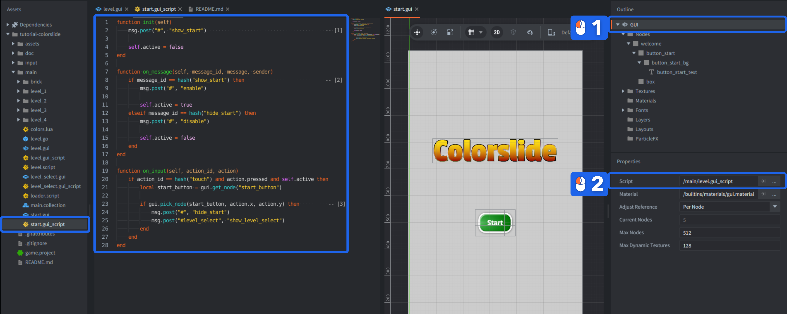

## Adding transition between the start and level select

The last thing is to connect this screen with the level select! Do the following steps:

1. Go to the ["main.collection"](defold://open?path=/main/main.collection).
2. Add `start.gui` to the `guis` game object (right click on `guis` game object ▸ <kbd>Add Component File</kbd> ▸ select `main/start.gui.gui`).

    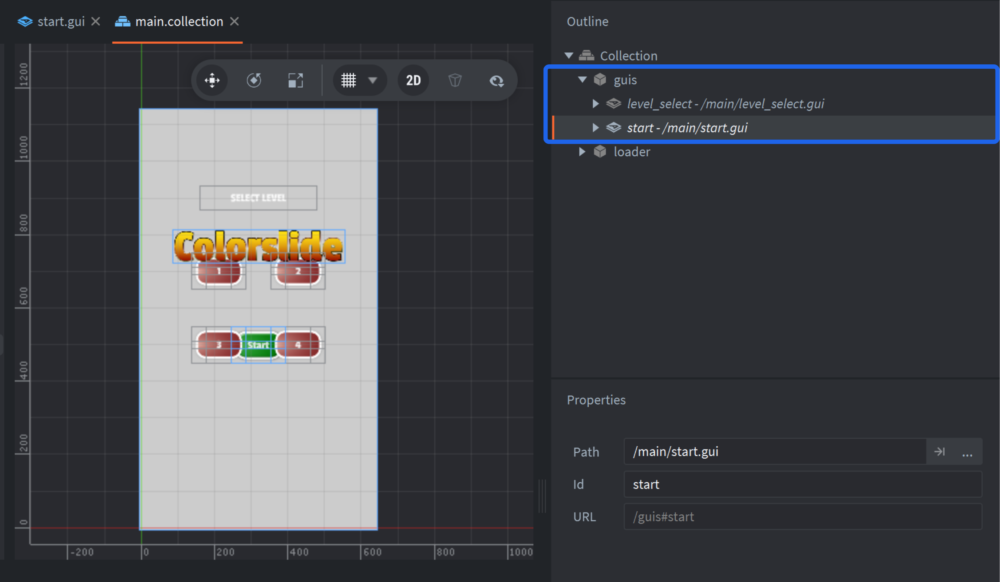


Save all and try your game - it should now welcome you with a start screen and you can click "Start" to proceed to the level selection!

## Getting back from level selection to the start menu

We only can't go back to start menu ever. Sometimes you might want it, e.g. if you have some other things to do in the start menu, so let's add this possibility!

We don't have a back button in the level selection GUI, because we didn't need it, but we added one in the level.gui, so we'll reuse it.

1. Open ["level.gui"](defold://open?path=/main/level.gui).
2. Copy the button `button_back` node.
3. Open ["level_select.gui"](defold://open?path=/main/level_select.gui).
4. Paste the button (with its children) to the root "Nodes".

    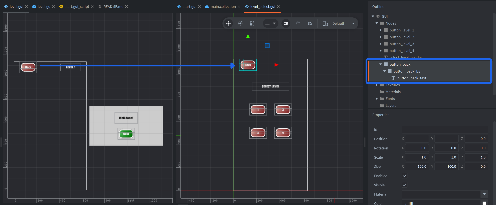

Now we only need to add code to handle the back button in the level selection:

1. Open ["level_select.gui_script"](defold://open?path=/main/level_select.gui_script).
2. Add the code for returning to the start screen in `on_input`:
    ```lua
    function on_input(self, action_id, action)
        if action_id == hash("touch") and action.pressed and self.active then
            for n = 1, 4 do
                local button_level = gui.get_node("button_level_" .. n)

                if gui.pick_node(button_level, action.x, action.y) then
                    msg.post("/loader#loader", "load_level", { level = n })
                    msg.post("#level_select", "hide_level_select")
                end
            end

            --- Add these lines:
            local button_back = gui.get_node("button_back")         -- [1]

            if gui.pick_node(button_back, action.x, action.y) then
                msg.post("#level_select", "hide_level_select")
                msg.post("#start", "show_start")
            end
            ---
        end
    end
    ```
    1. Check if the player clicks "back". If so, hide this GUI and show the start screen.


3. In the `init` function change line 3: <kbd>`msg.post("#", "show_level_select")`</kbd> to: <kbd>`msg.post("#", "hide_level_select")`</kbd>,

    ```lua
    function init(self)
        msg.post(".", "acquire_input_focus")
        msg.post("#", "hide_level_select")  -- [1]
        self.active = false
    end
    ```
    1. Change to "hide_level_select" so that instead of showing, we hide the level selection GUI on startup.
    

And that's it! Run the game and verify that everything works as expected and you can switch freely between the scenes.

The full source code for the project at this stage can be found in the [tutorial-done branch](https://github.com/defold/tutorial-colorslide/tree/tutorial-done).

## What's next?

We have reached the end of this tutorial. You learned how to create GUI screens, buttons, texts, and how to connect them all into one game flow.

This GUI implementation is quite simple. Each screen manages its own state and contains the code needed to hand over control to the next screen by sending messages to the other GUI component.

If your game does not feature complex GUI flows this method is sufficient and clear enough. However, for more advanced GUIs things can get complicated. In that case, you might want to use some kind of screen manager that controls the flow from a central location.

You can either roll your own or include an existing one as a library. Check out asset portal for [GUI libraries](https://defold.com/tags/stars/gui/).

We recommend to go through the source code once again to see how things are implemented in this game.

If you want to continue experimenting with this tutorial project, here are some suggested exercises:

1. You may have noticed that the "Level 1" header while playing a level is static. Add functionality so the header text shows the correct level number.
2. Implement level unlocking. Start the game with all except the first level locked and unlock them one by one as the game progresses.
3. Implement saving of the level unlock progression state. Here, you will need a system for saving and loading persistent data which is called "serialization". You can try and experiment with these ready-to-use libraries:
   1. [Defold Saver](https://defold.com/assets/defold-saver/).
   2. [DefSave](https://defold.com/assets/defsave/).
   3. [Defold Persist](https://defold.com/assets/defold-persist/).
4. Fix the case where the player completes the last level and there is no "next" one.
5. Use GUI templates to create the button once and make it reusable in many scenes of the game. You can read more information about GUI templates in [our manual](https://defold.com/manuals/gui-template/).
6. Make the buttons response visually (react to press) and with sound.
7. Add sound to the game.
8. Create a solution to when there are more levels than what fits the screen.

Check out [the documentation pages](https://defold.com/learn) for more examples, tutorials, manuals and API docs.

If you run into trouble, help is available in [our forum](https://forum.defold.com).

**Happy Defolding!**
